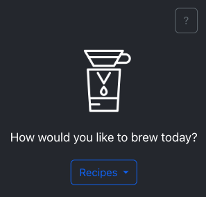
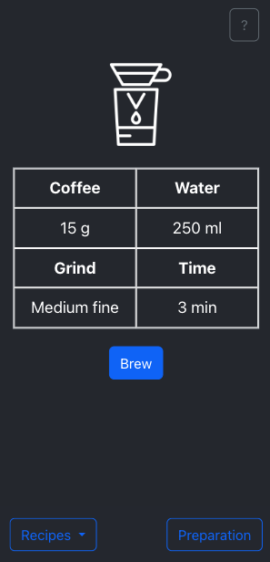
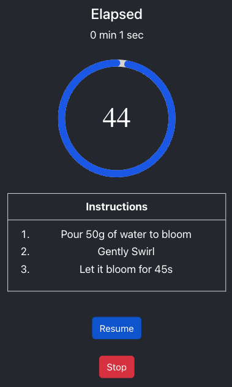
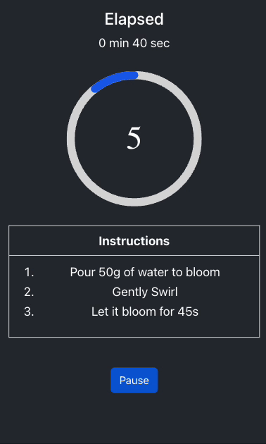

# ☕️ Brew Mate

## ❓ Overview

An app with a time-based step-by-step V60 brewing instructions display and timer function.
  
_**Landing page with V60 recipe dropdown list**_

<!--  -->

<kbd>  </kbd>
   
_**View Recipe Page after a V60 recipe was chosen**_

<!--  -->

<kbd>  </kbd>
  
_**Timer Instructions Page after pressing the brew button**_

## 💻 Technologies Used

☕️ Brew Mate was built using the following technologies:

- React: A JavaScript library for building user interfaces.
- React Bootstrap: Bootstrap JavaScript front-end framework built for React which provides compatible UI components
- react-countdown-circle-timer: Library that provides a React countdown timer component in a circle shape with color and progress animation.

## 📚 What we learnt

- To build a React app with class-based components.
- To leverage third-party library react-countdown-circle-timer to provide visual feedback to users along with the V60 recipe instructions
- To set up a timer in React. We used the time-elapsed information to provide users with V60 recipe instructions in intervals.
- To use React Bootstrap components such as DropdownButton and Modal to provide users with an interactive experience.
- To write CSS that allows the app to be responsive to both PC and mobile.

## 🌈 Features

- **Choose recipe:**
  Users can choose a from a list of V60 recipes from the dropdown list in the landing page.

- **FAQ and Preparation Infomation:**
  Users can view the FAQ and Preparation Infomation from the modal displayed by clicking the ? and Preparation button.

- **Time based step by step V60 brewing instructions display:**
  Users can follow the step-by-step V60 brewing instructions displayed depending on the time interval that the brewing process is at.

- **Timer:**
  Users can view the time-elapsed information to determine whether the brew was longer or shorten than expected.
  Users can also view the countdown timer animation to guide the speed of pouring.

## 🔮 Future Enhancements

Here are some possible enhancements and additional features to be implemented in the future:

- Previous and Skip button: To allow users to preview instructions without waiting for the timer.
- Brew Journal: To allow users to add their notes on their brew with the selected recipe.
- Save custom recipe: To allow users to add their brewing recipe.

## 📜 Available Scripts

To run the ☕️ Brew Mate locally, follow these steps:

1. Clone the repository: git clone <repository-url>
2. Navigate to the project directory: cd brew-mate
3. Install dependencies: npm install
4. Start the development server: npm start
5. Open your browser and visit: http://localhost:3000
   Make sure you have Node.js and npm installed on your machine before proceeding with the installation.

## 💽 Data Source

The V60 Recipes used in this app were sourced from the [Pouroverproject.com](https://pouroverproject.com/v60-recipes-rao-hoffman-kasuya-drip-coffee/) and [James Hoffman's YT Channel](https://www.youtube.com/watch?v=1oB1oDrDkHM).
